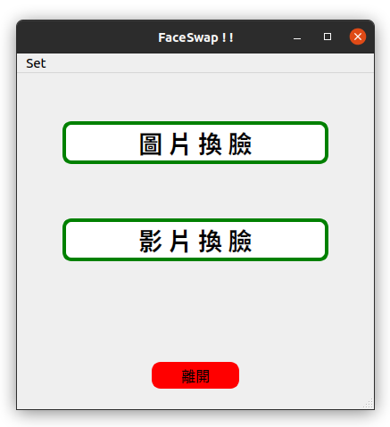

# Face
https://drive.google.com/file/d/1lsQS8hOCquMFKJFhK_z-n03ixWGkjT2P/view

下載後會有 cartoon_data 、 photo2cartoon_weights.pt 、 seg_model_384.pb 、 model_mobilefacenet.pth 

人像卡通化預訓練模型：photo2cartoon_weights.pt，存放在models路徑下。(20200504更新)

頭像分割模型：seg_model_384.pb，存放在utils路徑下。

人臉識別預訓練模型：model_mobilefacenet.pth，存放在models路徑下。（From: InsightFace_Pytorch）

卡通化開源數據：cartoon_data，包含trainB和testB。

人像卡通化onnx模型：photo2cartoon_weights.onnx (Google雲端硬碟)，存放在models路徑下。

PRNet Train Data:
https://drive.google.com/file/d/1UoE-XuW1SDLUjZmJPkIZ1MLxvQFgmTFH/view

https://github.com/YadiraF/PRNet/tree/master/Data

## 安裝環境
* **python==3.6.12**

* **pencv-python==4.1.0.25**

* **PyQt5==5.15.4**

* **matplotlib==3.3.3**

* **face-alignment==1.1.1**

* **tensorflow-gpu==1.14.0**

* **torchvision==0.8.1**

* **dlib==19.21.0****

## 初始主畫面

